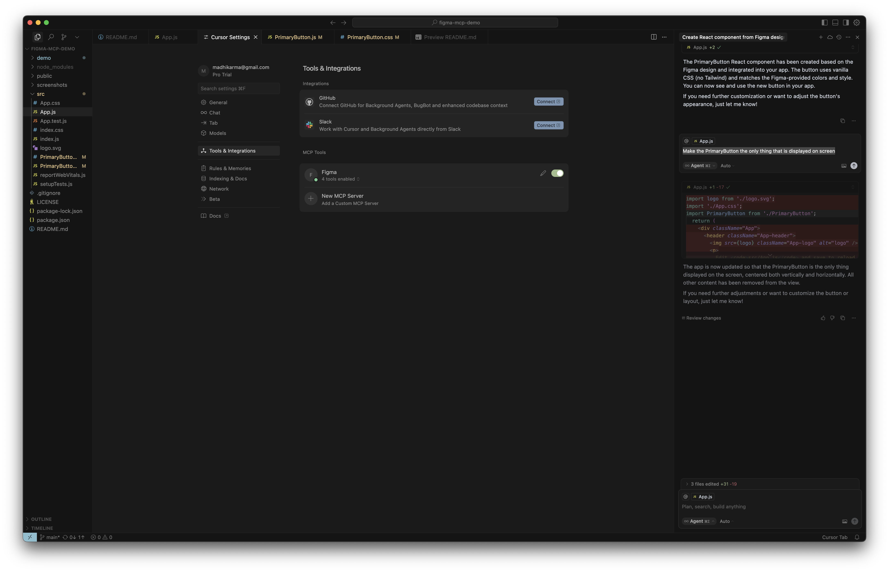
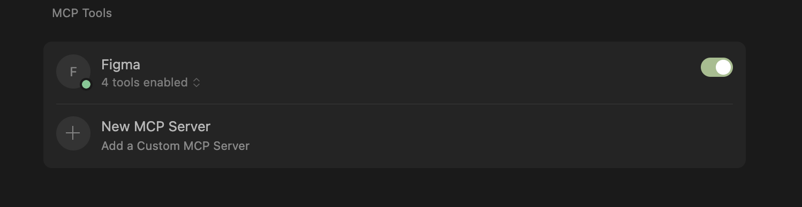
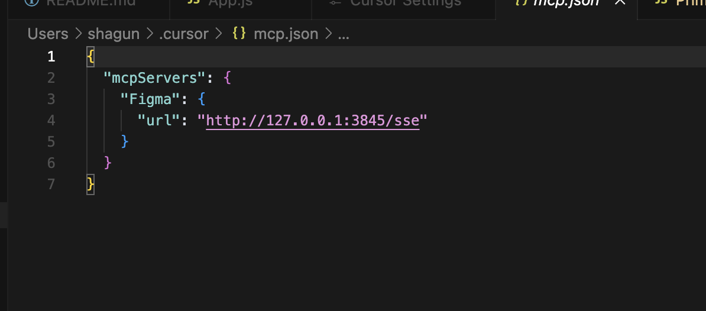
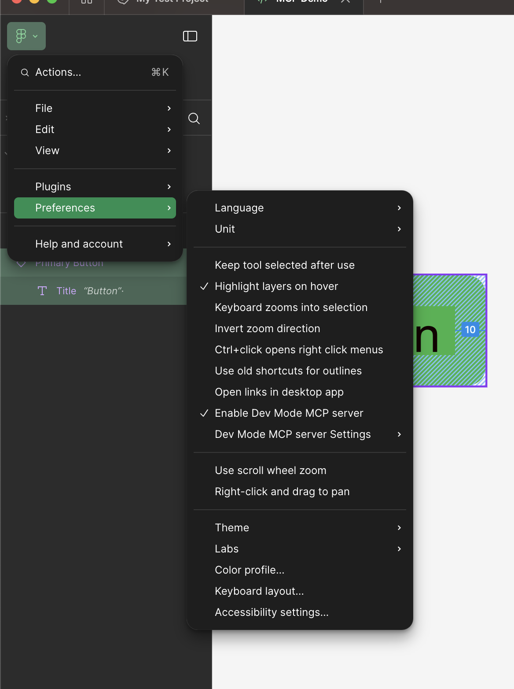
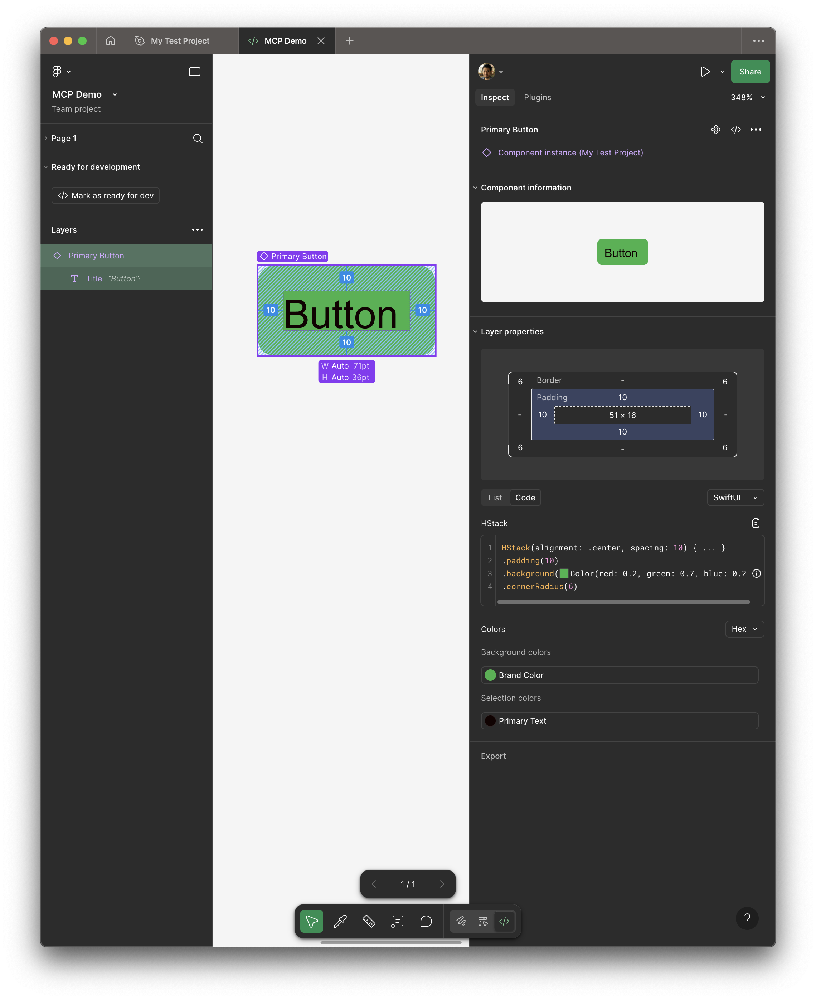
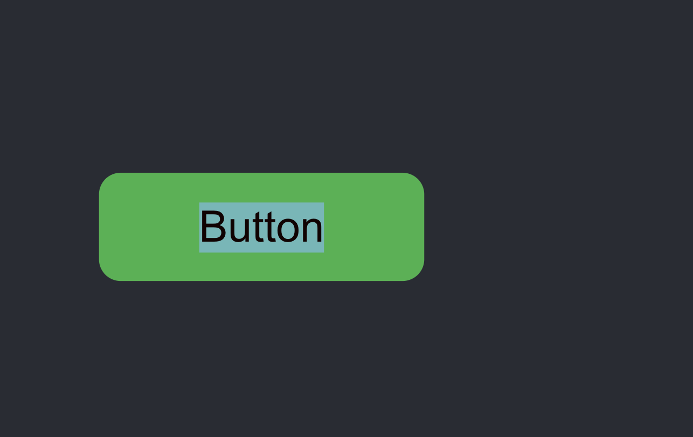
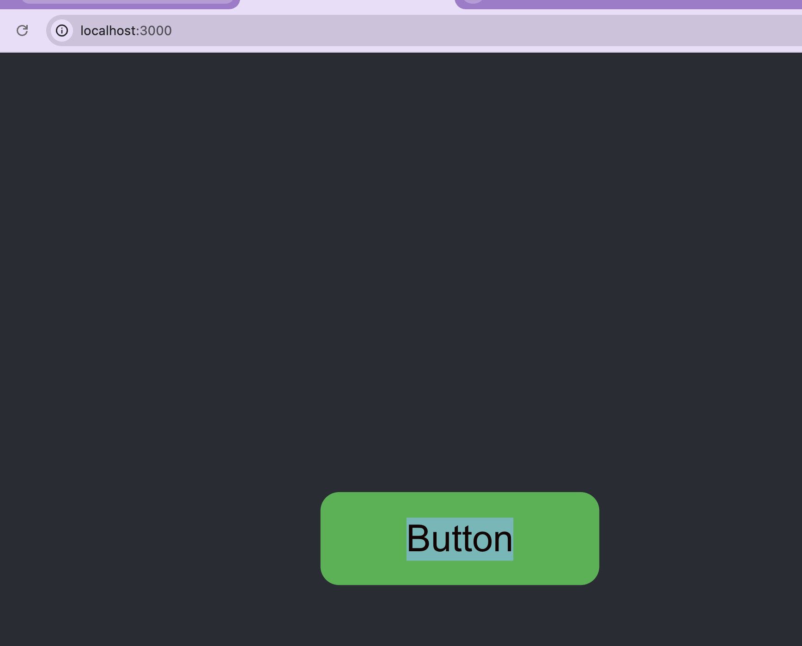

# Figma MCP Demo 

Demo web app for exploring Figma MCP integration (for code generation via AI)

This project was bootstrapped with [Create React App](https://github.com/facebook/create-react-app). (deprecated) 

- `npm install -g create-react-app`
- `npx create-react-app figma-mcp-demo`

## Environment
- nodeJS https://nodejs.org/en/download
- Cursor
- Figma 

## Installation

Install dependencies
- `npm install`

Start local web server (to view results in local web browser)
- `npm run start` 

## Setup

Configure Figma MCP server following these instructions https://help.figma.com/hc/en-us/articles/32132100833559-Guide-to-the-Dev-Mode-MCP-Server

### Cursor

- Cursor Settings > Add new MCP tool

```
{
    "mcpServers": {
        "Figma": {
            "url": "http://127.0.0.1:3845/sse"
        }
    }
}
```
<details>
<summary>Expand to view screenshots</summary>
    
    
    
</details>

### Figma 
- Enable MCP Dev Server (Note. not available on Free plans (only Team or Enterprise) Also Dev or Full seat )

<details>
<summary>Expand to view screenshots</summary>
    
</details>

## Usage


### Figma
- Copy URL to Figma component (or node)  
    - e.g. Using a sample PrimaryButton component from personal pproject @https://www.figma.com/design/kQSjh7sw77rH4jNflXpKX2/MCP-Demo?node-id=1-6&m=dev

### Cursor
-   Ask Cursor (or agent) to generate code 
    - e.g. `Create React component for @https://www.figma.com/design/kQSjh7sw77rH4jNflXpKX2/MCP-Demo?node-id=1-6&m=dev`

## Demo

Creating React component for a Figma PrimaryButton component 


<details>
    <summary>Expand to view screenshots</summary>
    
    
</details>

## Screenshots

<details>
    <summary>Expand to view screenshots</summary>
    





</details>

## Demo

<details>
    <summary>Expand to view demos</summary>
        
        
</details>

## Troubleshooting

- Getting 403 errors on prompt?
    - Ensure you have a non Free account (Pro or Enterprise) and a Full or Dev Seat
    - Ensure your Figma file is in your Figma project
- After adding the MCP to Cursor, restart Figma after
- Check the MCP server is running in your browser http://127.0.0.1:3845/sse

<details>
    <summary>Expand to view old README</summary>
## Available Scripts

In the project directory, you can run:

### `npm start`

Runs the app in the development mode.\
Open [http://localhost:3000](http://localhost:3000) to view it in your browser.

The page will reload when you make changes.\
You may also see any lint errors in the console.

### `npm test`

Launches the test runner in the interactive watch mode.\
See the section about [running tests](https://facebook.github.io/create-react-app/docs/running-tests) for more information.

### `npm run build`

Builds the app for production to the `build` folder.\
It correctly bundles React in production mode and optimizes the build for the best performance.

The build is minified and the filenames include the hashes.\
Your app is ready to be deployed!

See the section about [deployment](https://facebook.github.io/create-react-app/docs/deployment) for more information.

### `npm run eject`

**Note: this is a one-way operation. Once you `eject`, you can't go back!**

If you aren't satisfied with the build tool and configuration choices, you can `eject` at any time. This command will remove the single build dependency from your project.

Instead, it will copy all the configuration files and the transitive dependencies (webpack, Babel, ESLint, etc) right into your project so you have full control over them. All of the commands except `eject` will still work, but they will point to the copied scripts so you can tweak them. At this point you're on your own.

You don't have to ever use `eject`. The curated feature set is suitable for small and middle deployments, and you shouldn't feel obligated to use this feature. However we understand that this tool wouldn't be useful if you couldn't customize it when you are ready for it.

## Learn More

You can learn more in the [Create React App documentation](https://facebook.github.io/create-react-app/docs/getting-started).

To learn React, check out the [React documentation](https://reactjs.org/).

### Code Splitting

This section has moved here: [https://facebook.github.io/create-react-app/docs/code-splitting](https://facebook.github.io/create-react-app/docs/code-splitting)

### Analyzing the Bundle Size

This section has moved here: [https://facebook.github.io/create-react-app/docs/analyzing-the-bundle-size](https://facebook.github.io/create-react-app/docs/analyzing-the-bundle-size)

### Making a Progressive Web App

This section has moved here: [https://facebook.github.io/create-react-app/docs/making-a-progressive-web-app](https://facebook.github.io/create-react-app/docs/making-a-progressive-web-app)

### Advanced Configuration

This section has moved here: [https://facebook.github.io/create-react-app/docs/advanced-configuration](https://facebook.github.io/create-react-app/docs/advanced-configuration)

### Deployment

This section has moved here: [https://facebook.github.io/create-react-app/docs/deployment](https://facebook.github.io/create-react-app/docs/deployment)

### `npm run build` fails to minify

This section has moved here: [https://facebook.github.io/create-react-app/docs/troubleshooting#npm-run-build-fails-to-minify](https://facebook.github.io/create-react-app/docs/troubleshooting#npm-run-build-fails-to-minify)

</details>
